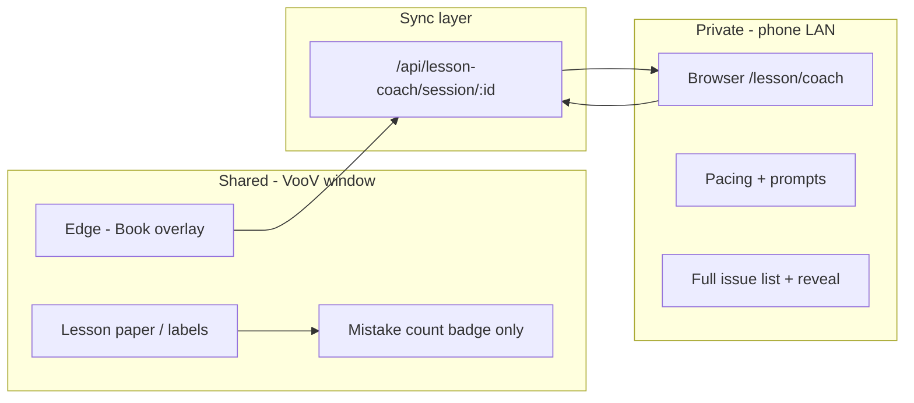

# Teacher Cockpit & Dictation Mode — phased plan

**Status:** Phase 7 complete (hybrid grammar). Update the phase table as work completes.

**Related docs:** `docs/PHASE0.md` (screen share / run target), Writing Assist v2 plan (`.cursor/plans/writing_assist_v2_*.plan.md` if present), `docs/CLASS_SESSION_FLOW_TASKS.md` (class session lifecycle).

**Milestone tie-in:** Live 1:1 teaching — teacher types on shared screen; coaching (pacing, prompts, grammar) stays **off** the student’s view via phone/tablet on the same Wi‑Fi.

---

## 1. Problem statement

Two distinct writing needs during lessons:

| Mode | Who “owns” the text | Teacher goal | UX principle |
|------|---------------------|--------------|--------------|
| **Teacher writing** | Teacher’s notes | Fast, correct typing | Seamless word fix **or** subtle “something’s off” indicator |
| **Student dictation** | Student’s spoken English (typed verbatim) | Teach **noticing** then repair | **Never** spoil answers on the shared screen; coach from a private surface |

**Student dictation ritual (pedagogy):**

1. Type what the student said (verbatim — no silent grammar rewrite while typing).
2. Run **Check** → shared UI shows **mistake count only** (e.g. `3 issues`), not locations or fixes.
3. Ask: “Can you find what’s wrong?”
4. If they can’t: **stage** help — highlight one zone → guiding question → one fix + short explanation (teacher speaks detail; UI stays minimal on shared screen).
5. Full issue list, pacing, and “what to ask next” live on **Teacher Cockpit** (phone/tablet), not on VooV-shared window.

**Grammar pain points (later phases):** sentence structure, punctuation, articles (`a` / `an` / `the`). Word-level Writing Assist does **not** solve these; they need grammar-lite rules and/or a grammar engine (LanguageTool / LLM), with **teacher-only** explanations.

---

## 2. Screen share setup (operator)

**Recommended today (no build):**

| Surface | Device / app | VooV shares? |
|---------|----------------|--------------|
| Book reader, labels, lesson paper | **Edge** (or one browser window) | **Yes** — share **application window** only |
| Pacing, prompts, grammar detail | **Phone/tablet browser** or Chrome on **monitor 2** | **No** |

**Rules:**

- Share **window**, not entire screen (avoids leaking monitor 2 or notifications).
- Do **not** put secrets in the same window as the reader (floating panels on the shared monitor are risky).
- `localhost` on the phone does not reach the PC — use `http://<PC-LAN-IP>:3000/...` (see §7).

**Phase 0 manual workaround:** Edge = lesson; second screen or phone = Notion/doc for pacing + handwritten correction notes until Cockpit ships.

---

## 3. Relationship to Writing Assist

**Existing (`lib/writing-assist/`):**

- Space autocorrect (SymSpell), Tab/ghost next-word, lesson vocabulary, session bigrams, ngram file (`public/writing-assist/en-us-bigrams.json`).
- Surfaces: `book-page-annotation-dom-layer.tsx`, `LessonPaperPanel.tsx`, `WritingAssistProvider` in `fullscreen-book-overlay-view.tsx`.

**Writing Assist v2 (may be partially complete — verify before Cockpit Phase 3):**

| Item | Intended state |
|------|----------------|
| `buildLessonVocabulary` + interactive vocab | Done |
| `suggestNextWords()` top 3 | Done in `ghost-complete.ts` |
| Ghost state in `writing-assist-context.tsx` | Done |
| `use-writing-assist.ts` provider ghost + ↑↓ / Space suffix | **Verify / finish** |
| `WritingAssistInlineGhost` + dom-layer wiring | **Verify / finish** |
| Multi-candidate `WritingAssistGhostHintBar` | **Verify / finish** |
| Extended tests | **Verify / finish** |

**Cockpit must not duplicate** ghost/autocorrect logic. Dictation mode should **disable** silent grammar fix on the shared field; teacher-write mode keeps current assist.

---

## 4. Architecture (target)



**Why API sync (not only `BroadcastChannel`):**

- `BroadcastChannel` / `localStorage` events work **same browser profile on one PC only**.
- Phone on Wi‑Fi needs **HTTP** (or WebSocket) to the Next dev/production server on the teacher’s PC.

**Session model (minimal):**

```ts
type LessonCoachSession = {
  id: string
  updatedAt: number
  // Context (for pacing injection later)
  studentId?: string
  bookId?: string
  unitId?: string
  partId?: string
  // Mode
  dictationMode: boolean
  // Shared-facing
  activeField: 'lesson-paper' | 'label' | null
  sharedText: string
  issueCount: number          // student may see
  revealedCount: number       // how many issues teacher has surfaced
  // Teacher-only (never rendered on shared UI)
  issues: GrammarIssue[]      // full list
  pacingNotes: string         // markdown or plain
  promptScript: string[]      // “Can you find 3 mistakes?”
  revealIndex: number         // staged reveal cursor
}
```

**Storage v1:** In-memory `Map` on server (dev/LAN); lost on server restart — acceptable for live lessons. **v2:** optional persist to `localStorage` backup on PC or `esl_*` key per session id.

---

## 5. Phase overview

| Phase | Name | Outcome |
|-------|------|---------|
| **0** | Operator + doc | Manual two-screen workflow documented (this file + PHASE0 note) |
| **1** | Session sync + coach route shell | Phone opens `/lesson/coach?session=…`; ping/pong state |
| **2** | Cockpit UI (pacing + prompts) | Editable pacing/prompts on phone; QR/link from overlay |
| **3** | Dictation mode + count badge | Verbatim typing; shared count only; no grammar autocorrect |
| **4** | Grammar-lite + issue pipeline | Offline rules → issues[] → cockpit list + count |
| **5** | Staged reveal + apply fix | Highlight → reveal one → apply to shared text (one at a time) |
| **6** | Pacing from book / class prep | Pull `pacing` from book context into cockpit |
| **7** | Full grammar (optional) | LanguageTool or LLM; ESL explanations |

---

## 6. Phase 0 — Operator (no code)

**Tasks**

- [ ] Confirm VooV shares **Edge window only**; practice preview before class.
- [ ] Note PC LAN IP (`ipconfig` → Wi‑Fi IPv4) in `MILESTONE.md` → Notes.
- [ ] Optional: bookmark a Notion/Google Doc on phone for pacing until Phase 2.

**Exit criteria:** One successful call with zero leaks from monitor 2 / phone content.

---

## 7. Phase 1 — Session sync + coach route shell

**Goal:** Phone and PC share one lesson-coach session over LAN.

**Tasks**

1. **`lib/lesson-coach/types.ts`** — `LessonCoachSession`, `GrammarIssue` stub, Zod sanitize.
2. **`lib/lesson-coach/session-store.ts`** — in-memory store, TTL prune (e.g. 24h), `get` / `patch` / `create`.
3. **API routes** (App Router):
   - `POST /api/lesson-coach/session` → `{ id, url }`
   - `GET /api/lesson-coach/session/[id]`
   - `PATCH /api/lesson-coach/session/[id]` — partial update
4. **`app/lesson/coach/page.tsx`** — mobile-first layout; poll session every 1–2s (or SSE later); show “Waiting for lesson…” + connection status.
5. **`lib/lesson-coach/use-lesson-coach-session.ts`** — client hook: `createSession`, `subscribe(sessionId)`, `patch`.
6. **Overlay entry:** small “Open coach on phone” control in fullscreen overlay (toolbar or lesson notebook header) → creates session, shows **QR** + copyable URL `http://<host>:3000/lesson/coach?session=<id>`.
7. **Dev networking:** document `npm run dev` with host `0.0.0.0` if phone cannot connect (see §10).

**Files (new / touch)**

| Action | Path |
|--------|------|
| New | `lib/lesson-coach/*`, `app/api/lesson-coach/session/...`, `app/lesson/coach/page.tsx` |
| Update | `components/students/fullscreen-book-overlay/...` (link + QR) |
| Update | `docs/PHASE0.md` — one paragraph + link here |

**Exit criteria**

- [ ] PC opens overlay → “Coach” → QR scans on phone → coach page shows `connected` and same `sessionId`.
- [ ] Patch `pacingNotes` on phone → appears on PC hook within poll interval.
- [ ] Works on `http://192.168.x.x:3000` from phone (same Wi‑Fi).

---

## 8. Phase 2 — Cockpit UI (pacing + prompts)

**Goal:** Teacher-only phone UI useful even before grammar.

**Tasks**

1. **Sections on `/lesson/coach`:**
   - **Pacing** — textarea, autosave to session (`pacingNotes`).
   - **Prompts** — checklist / chips: “How many mistakes?” “Can you find them?” “Look at the article here.”
   - **Session info** — student name, book/page if available from overlay patch.
2. **Defaults** — seed `promptScript` on session create from templates (`lib/lesson-coach/default-prompts.ts`).
3. **UX** — large tap targets, dark/light readable at arm’s length; no dependency on student reader CSS.
4. **Optional:** “Add to Home Screen” hint in UI (PWA later).

**Exit criteria**

- [ ] Teacher runs lesson with only pacing + prompts on phone; no grammar yet.
- [ ] Notes survive refresh (session PATCH persisted server-side for duration of server run).

---

## 9. Phase 3 — Dictation mode + count badge

**Goal:** Shared screen safe for “type what they said.”

**Tasks**

1. **Toggle `dictationMode`** on lesson paper (and optionally per-label later):
   - When on: disable Space autocorrect on that field; disable ghost insert (or hide ghost UI).
   - When off: normal Writing Assist behavior.
2. **Sync** `dictationMode` + `sharedText` to coach session on debounced input.
3. **Shared badge** (lesson paper only v1): e.g. `3 issues` or `Check` button — **no** underline list on shared UI.
4. **Coach shows** `sharedText` read-only + “Run check” (Phase 4).

**Files**

| Action | Path |
|--------|------|
| Update | `LessonPaperPanel.tsx`, `use-writing-assist.ts` (respect dictation flag from context or session) |
| Update | `writing-assist-context.tsx` or overlay controller — `dictationMode` prop |

**Exit criteria**

- [ ] Dictation on: typing `he go to school` stays verbatim on shared screen.
- [ ] Phone shows full text; students only see count after check (Phase 4) or “—” before check.

---

## 10. Phase 4 — Grammar-lite + issue pipeline

**Goal:** Offline, high-confidence checks; populate teacher issue list + count.

**Tasks**

1. **`lib/lesson-coach/grammar-lite.ts`** — rule-based passes, e.g.:
   - Sentence-start capitalization, lone `i` → `I`
   - Space after `.?!`
   - `a` + vowel sound → `an` (simple vowel letter rule only)
   - Double spaces
   - *(Not:* full article choice, word order — defer to Phase 7)
2. **`analyzeText(text): GrammarIssue[]`** — `{ id, start, end, type, message, suggestion, explanation? }`.
3. **Check action** — manual button on coach (and optional shortcut on PC); writes `issues` + `issueCount` to session.
4. **Coach UI** — list issues collapsed; tap expands teacher-only explanation stub.

**Exit criteria**

- [ ] `he go to school` → count ≥ 1; list on phone only.
- [ ] Shared badge shows number only, not which words.

---

## 11. Phase 5 — Staged reveal + apply fix

**Goal:** Support the classroom ritual end-to-end.

**Tasks**

1. **Reveal states per issue:** `hidden` | `highlighted` | `revealed` | `applied`.
2. **Coach controls:** “Highlight next”, “Show fix”, “Apply fix” (one at a time).
3. **Shared UI:** single highlight region or bracket at a time; optional one-line replacement when teacher applies.
4. **Undo** one applied fix (stack) — teacher mistake recovery.
5. **Patch sync** so PC lesson paper text updates when coach applies fix (coach sends full `sharedText` or patch ops).

**Pedagogy defaults (config):**

- Auto-increment `revealedCount` for badge “2 of 3 found” optional — default **off** (teacher controls narrative).

**Exit criteria**

- [ ] Full flow: type → check → count on shared → find game → reveal from phone → one fix appears on shared text.
- [ ] Explanations only on coach screen unless teacher applies visible fix.

---

## 12. Phase 6 — Pacing from book / class prep

**Goal:** Less manual copy-paste into cockpit.

**Tasks**

1. On session create from overlay, patch `bookId`, `unitId`, `partId`, `studentId`.
2. Load book context `pacing: string[]` (see `lib/context/types.ts`, class prep / `save-book` API).
3. Pre-fill `pacingNotes` from unit/book pacing + part goals if available.
4. Optional: link to existing class session (`in_progress`) from `CLASS_SESSION_FLOW_TASKS.md`.

**Exit criteria**

- [ ] Opening coach for a vocab part shows relevant pacing bullets without retyping.

---

## 13. Phase 7 — Full grammar (optional)

**Goal:** Articles, structure, richer punctuation.

**Options (pick one when reaching this phase):**

| Option | Pros | Cons |
|--------|------|------|
| **LanguageTool** (self-hosted JAR or public API) | Strong rules, explanations | Ops / latency / privacy |
| **LLM** (existing Gemini routes) | ESL-friendly copy | Network, cost, needs confirm UI |
| **Hybrid** | Lite offline + LLM on “Deep check” | More code |

**Tasks**

- Replace or augment `grammar-lite` analyzer.
- Keep **same** `GrammarIssue` shape and reveal UX from Phase 5.
- Teacher confirms before bulk apply; never silent full-sentence rewrite in dictation mode.

**Exit criteria**

- [ ] Article error detected on sample sentences; explanation on coach only.

---

## 14. Out of scope (for now)

- Native iOS/Android app (use browser + optional PWA).
- Student-visible grammar underlines before the “find it” step.
- Cloud sync across cities without hosted URL (LAN-first; Vercel later if needed).
- Persistent per-student grammar profile across weeks.
- Automatic transcription of student speech (teacher types).

---

## 15. LAN / phone connection cheat sheet

| Step | Action |
|------|--------|
| 1 | PC and phone on same Wi‑Fi (not guest-isolated). |
| 2 | `ipconfig` → IPv4 e.g. `192.168.1.42`. |
| 3 | Run **`npm run dev:lan`** (`next dev -H 0.0.0.0`). Add your PC IPv4 to **`allowedDevOrigins`** in `next.config.mjs` (or `ALLOWED_DEV_ORIGINS` in `.env.local`) — required on Next.js 16 or buttons/React won't work on the IP URL. |
| 4 | Windows Firewall: allow Node on **Private** networks. |
| 5 | Phone: `http://192.168.1.42:3000/lesson/coach?session=<id>` or scan QR from overlay. |

**Hosted URL (Vercel):** Phone can coach from anywhere; session store must not be in-memory only — upgrade store before relying on this.

---

## 16. Manual test checklist (end-to-end)

After Phase 5:

- [ ] VooV shares Edge only; coach on phone not visible in recording.
- [ ] Dictation mode: no autocorrect on Space for student sentence.
- [ ] Check → shared shows `N issues` only.
- [ ] Coach lists N items; shared does not.
- [ ] Reveal one issue → shared shows one highlight or one fix.
- [ ] Pacing notes editable on phone during call.
- [ ] Server restart mid-lesson → expect session loss (document); recreate QR.

---

## 17. Progress tracker

| Phase | Status | Completed |
|-------|--------|-----------|
| 0 Operator | [ ] | |
| 1 Session + route | [x] | 2026-05 |
| 2 Cockpit UI | [x] | 2026-05 |
| 3 Dictation + badge | [x] | 2026-05 |
| 4 Grammar-lite | [x] | 2026-05 |
| 5 Staged reveal | [x] | 2026-05 |
| 6 Book pacing | [x] | 2026-05 |
| 7 Full grammar | [x] | 2026-05 (hybrid: lite + Gemini) |

**Dependencies before Phase 3:** Finish Writing Assist v2 hook/UI gap (see §3) so dictation toggle cleanly disables assist.

**Next implementation step:** Polish Writing Assist v2 gaps in §3, or harden coach session persistence beyond in-memory store.

---

## 18. Key file map (existing)

| Area | Path |
|------|------|
| Fullscreen overlay | `components/students/fullscreen-book-overlay/fullscreen-book-overlay-view.tsx` |
| Lesson paper | `components/students/fullscreen-book-overlay/sections/LessonPaperPanel.tsx` |
| Annotations | `components/students/book-page-annotation-dom-layer.tsx` |
| Writing Assist | `lib/writing-assist/*` |
| Book pacing data | `lib/context/types.ts`, class prep / `app/api/context/save-book/route.ts` |
| Class sessions | `docs/CLASS_SESSION_FLOW_TASKS.md`, `lib/students/selectors.ts` |

---

*Last updated: plan created for Teacher Cockpit + Dictation Mode feature. Edit this file when phases ship or requirements change.*
