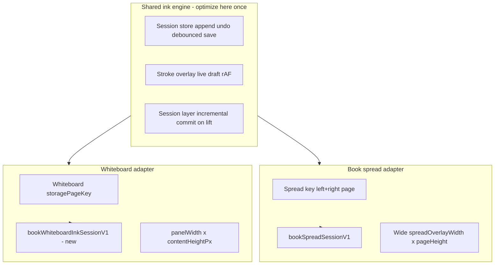

# Whiteboard ink — unified engine plan

**Goal:** Wire the **whiteboard** through the **same fast ink engine** as the book spread (session store + live overlay + incremental committed layer). When you optimize that engine later, you change it **once** — book and board both benefit.

**Not in scope:** Copying drawings between book and board. Separate saved ink, shared **machinery** only.

**Milestone tie-in:** Phase 1 lesson ritual — annotate book **and** board without lag.

**How we ship:** One phase → you test → keep or revert (flag off) → next phase. **Do not skip test gates.**

---

## What went wrong before (do not repeat)

| Mistake | Effect |
|---------|--------|
| Runtime **stroke-count cap** that disabled incremental paint | Every pen lift → **full redraw** of all ink → unusable for quick letters |
| Board still on **old page layer** while “session” added on top | Double work, or wrong layer still doing full replay + save every stroke |
| Big change in one step | Hard to see which part caused slowdown |

This plan uses a **feature flag default OFF**, **pen-only first**, and **explicit non-goals** per phase.

---

## Target architecture (end state)

**Page layer on board** (unchanged role): text, sticky, stamp, callout — and **no canvas ink paint** when delegation is on (same idea as `spreadInkDelegated` on book pages).

---

## Safety rails (all phases)

1. **`whiteboardInkSessionEnabled`** in `lib/books/feature-flags.ts` — default **`true`** (Phase 5 shipped). Set **`false`** to roll back to legacy board canvas.
2. **`spreadSessionEditingEnabled`** — **unchanged**; book path untouched unless a phase explicitly says “shared extract only.”
3. **No runtime perf caps** on incremental paint (no `spread-session-perf-config` style guards).
4. **Rollback** — set `whiteboardInkSessionEnabled = false` → board instantly back to today’s behavior.
5. **Persist:** debounced session checkpoint (~3s, same as book) + flush to existing whiteboard storage key on close/teardown (so old data path still works).

---

## Test script (repeat after every phase)

Run with board open (slot or fullscreen). Compare to book spread when relevant.

1. Pen **tap** on board — dot stays after lift.
2. One **letter** — no jump on release.
3. **20 letters** quickly — **no growing pause** after each lift (primary gate).
4. **Undo** one letter while pen active.
5. Add **text** on board — still works (page layer).
6. **Close board / reload lesson** — ink returns.
7. **Book spread pen** — still passes items 1–4 (regression check).

---

## Phases

| Phase | Name | Flag | Outcome |
|-------|------|------|---------|
| **0** | Plan + guardrails | OFF | This doc, feature flag, parking-lot note; **no behavior change** |
| **1** | Shared types + pen on board | OFF (dev can flip locally) | Generalize session key/storage; board pen via overlay + store + session layer; page layer **delegates** pen canvas |
| **2** | Board save + hydrate | OFF | Debounced save; load legacy whiteboard ink into session; flush back to legacy key on teardown |
| **3** | Marker + live parity | OFF | Marker on board session; multiply slices (same as book) |
| **4** | Eraser, shapes, select, undo | OFF | Tool parity on board; toolbar/keyboard → session store |
| **5** | Ship | **ON** | Flag default true; page layer hard-blocks canvas ink commit when delegated |
| **6** | Engine rename (optional) | ON | Rename spread-* → ink-* in code for clarity; **no logic change** |

---

## Phase 0 — Plan + guardrails

**Code:** Add `whiteboardInkSessionEnabled = false` to feature flags. Optional one-line pointer in `MILESTONE.md` or `PARKING_LOT.md`.

**Test:** App behaves exactly as today.

**Rollback:** N/A.

---

## Phase 1 — Shared plumbing + pen only (board behind flag)

**Judgment:** Safest first real step. Smallest surface: **pen only**, flag off in repo default.

### Extract / generalize (minimal)

- **Session key** — union or parallel type for whiteboard: `{ studentId, bookId, unitId, storagePageKey }` + `docId()` helper.
- **Storage** — `bookWhiteboardInkSessionV1` (separate localStorage root from spread, same adapter pattern as `spread-session-storage.ts`).
- **Reuse as-is where possible** (rename later in Phase 6):
  - `createSpreadSessionStore` → accept generic key + storage adapter (or thin wrapper `createInkSessionStore`).
  - `BookSpreadStrokeOverlay` → pass `spreadSessionMode` / dimensions from whiteboard (no seam split on commit when single surface).
  - `BookSpreadSessionLayer` → `widthPx` / `heightPx` = panel size.

### Wire `InfiniteWhiteboardPanel`

When `whiteboardInkSessionEnabled`:

- Mount **stroke overlay** (capture pen) + **session layer** (committed ink) inside the scrollable content `div` (same size as today: `panelWidthPx` × `contentHeightPx`).
- `BookPageAnnotationLayer` gets **`whiteboardInkDelegated`** (same filter as spread: hide pen/marker/shape canvas on page layer).
- **Marker / eraser / shapes** still off or still on page layer only — document which in PR; prefer **pen-only** on overlay for Phase 1.

### Toolbar

- `useAnnotationController`: when whiteboard open + flag + store exists, pen undo/redo → session store (mirror spread).

### Explicit non-goals (Phase 1)

- No change to book spread wiring.
- No marker/eraser/shapes on session yet.
- No command-count perf cap.
- No persist beyond memory (session lost on refresh OK for Phase 1 dev test).

### Test gate

- Flag **on locally:** pen on board passes script items 1–4; book still OK.
- Flag **off:** board unchanged from today.

---

## Phase 2 — Save + hydrate (board)

**Judgment:** Required before teachers rely on it.

- On session mount: **hydrate** from `getAnnotationsForStorageKey(..., storagePageKey)` — canvas commands → session; DOM commands (text/sticky) → stay on page layer state.
- **Debounced** checkpoint to `bookWhiteboardInkSessionV1` (reuse `SPREAD_SESSION_AUTOSAVE_MS`).
- On board close / teardown / `beforeunload`: **flush** session canvas commands back into legacy whiteboard storage (merge with DOM commands from page layer), same pattern as `flushSpreadSessionDocumentToPageStorage` for spreads.

### Explicit non-goals

- Do not remove legacy load path on page layer until Phase 5.
- No runway/tile optimization yet.

### Test gate

- Draw pen, wait 3s, refresh — ink returns.
- Text on board still saves/loads as today.
- 20 letters still snappy.

---

## Phase 3 — Marker on board session

- Marker commits to session store (overlay capture includes marker).
- Session layer: per-marker multiply slices (already in `BookSpreadSessionLayer`).
- Page layer: marker not painted when delegated.

### Test gate

- Crossed highlighter strokes darken on board.
- 20 letters pen still snappy (regression).

---

## Phase 4 — Eraser, shapes, select, one undo stack

- Same tool set as book spread Phase 5: eraser-line preview on session, shapes via overlay commit, select on session layer + `spread-session-select-proxy` pattern for whiteboard store ref.
- Keyboard shortcuts while board focused.

### Test gate

- Eraser + undo; select move/delete; shape draw.
- 20 letters pen still snappy.

---

## Phase 5 — Ship (flag on)

- `whiteboardInkSessionEnabled = true` by default.
- Board canvas ink **must not** commit through `commitDraftStroke` → full page replay when flag on.
- Dev smoke: book + board full test script.

### Rollback

- Set flag `false`.

---

## Phase 6 — Rename only (optional, parkable)

- Rename `SpreadSession*` types/files to `InkSession*` where shared; update imports and Cursor rule.
- **Zero** paint/save logic changes in this phase.
- Only after Phase 5 stable.

---

## Shared engine checklist (for future you)

When optimizing “the engine,” touch these **once**:

| Piece | Book today | Board after plan |
|-------|------------|------------------|
| Store `appendCommand` / undo | `spread-session-store.ts` | Same store |
| Live overlay + rAF | `book-spread-stroke-overlay.tsx` | Same overlay |
| Committed incremental paint | `book-spread-session-layer.ts` | Same layer |
| Debounce ms | `ink-session-persist-config.ts` | Shared constant |

**Do not** optimize `BookPageAnnotationLayer` canvas replay for pen on board after Phase 5 — that path should be dead for canvas ink.

---

## Parking lot (not in this plan)

- Viewport **tiles** for very tall whiteboard (OneNote-style) — only if 20-letter test fails after Phase 5 due to height.
- Pressure / prediction ink (native notebook tier).
- Merging `bookSpreadSessionV1` and `bookWhiteboardInkSessionV1` storage roots (unnecessary).

---

## Changelog

| Date | Phase | Note |
|------|-------|------|
| 2026-06-01 | 0 | Plan created. Book spread Phases 1–6 done; board still on legacy page layer. |
| 2026-06-01 | 1 | Shared `ink-session-store`; whiteboard pen via overlay + session layer behind `whiteboardInkSessionEnabled` (default OFF). Memory-only session; marker/shapes still on page layer. |
| 2026-06-01 | 2 | Debounced `bookWhiteboardInkSessionV1` checkpoint; hydrate pen from legacy whiteboard key; flush merged ink on close/unload/capture. |
| 2026-06-01 | 2b | Viewport-sized pen ink (sticky band = visible height, not full runway); document-normalized storage unchanged. |
| 2026-06-01 | 2c | Short-stroke feedback: flush live paint on lift (not cancel), defer clearing draft until session layer paints; incremental live segments on whiteboard viewport. |
| 2026-06-01 | 3 | Marker on board session: capture + hydrate/flush include marker; page layer hides pen/marker canvas when delegated. |
| 2026-06-01 | 4 | Eraser, shapes, select on board session; toolbar/keyboard use session undo; viewport-aware select hit-test. |
| 2026-06-01 | 5 | Shipped: `whiteboardInkSessionEnabled` default on; page layer cannot commit canvas ink when session owns it. |
| 2026-06-01 | 6 | Rename-only: shared `ink-session-*` modules (page-layer, persist-config, select-proxy); old `spread-session-*` paths re-export. |
